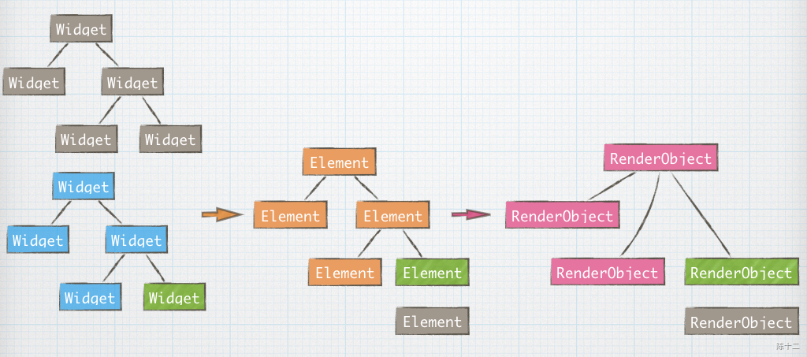
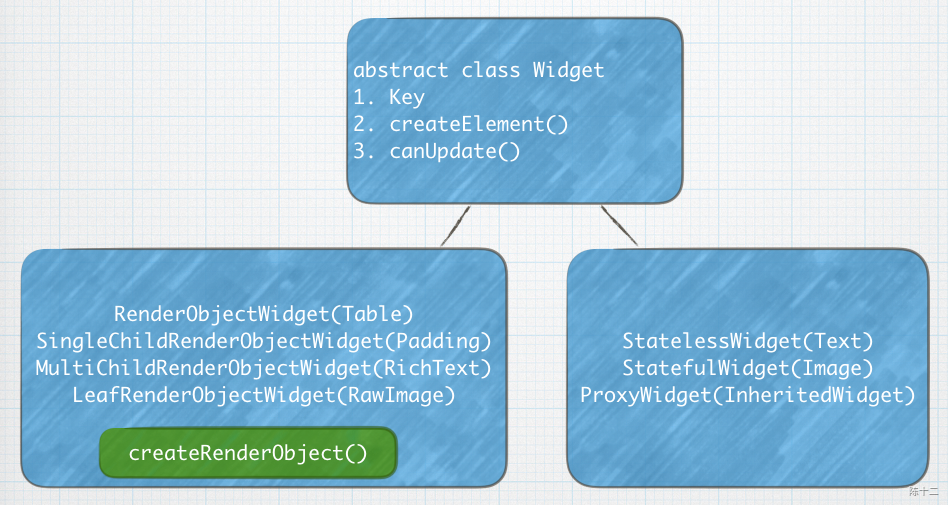
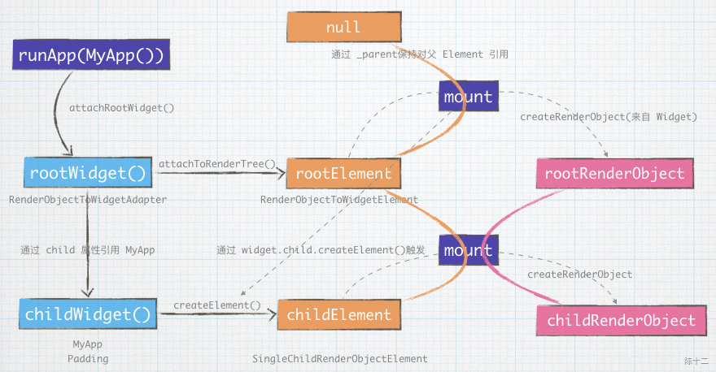

# Flutter 初始化与刷新源码解读

# 1. 前言

# 2. Flutter 初始化

Widget --> Element  --> RenderObject  -->   Skia渲染  -->  update(Element 复用)


Flutter 初始化：依据 WidgetTree 生成 ElementTree，并生成对应的 RenderObjectTree。


Flutter Update:（Widget Flutter 对视图的结构化描述， 是不可变的）





虽然只改变了一个节点，但是会销毁整个旧 WidgetTree，生成一棵新 WidgetTree，ElementTree 与 RenderObjecrTree 只替换变更的节点。

## 2.1 Widget 的种类

Widget 有两种：一种是常见的 StatelessWidget StatefulWidget，他们只是组装 Widget 的容器，没有渲染能力。另外一类是 RenderObjectWidget（如 RichText RowImg），他们才是真正能控制渲染的 Widget。所以并不是每一个 Widget 都有对应的 RenderObject。 所以上边的 RenderObject 树与 Element 树并没有完全一致。




## 2.2 从 runApp 开始



runApp()

```plain
// /packages/flutter/lib/src/widgets/binding.dart   line844
// https://github.com/flutter/flutter/blob/c1920c4c03dd55fd189d04f9b3964c77943f7c76/packages/flutter/lib/src/widgets/binding.dart#L867
void runApp(Widget app) {
  WidgetsFlutterBinding.ensureInitialized()
    ..attachRootWidget(app)
    ..scheduleWarmUpFrame();
}
```
## 2.3 创建根 Widget （RenderObjectToWidgetAdapter）

attachRootWidget()   **创建了根 Widget**

创建RenderObjectToWidgetAdapter，此为 rootWidget, 我们自己的 Widget 作为 RenderObjectToWidgetAdapter 的 child。

```plain
// /packages/flutter/lib/src/widgets/binding.dart   line791
// https://github.com/flutter/flutter/blob/c1920c4c03dd55fd189d04f9b3964c77943f7c76/packages/flutter/lib/src/widgets/binding.dart#L814
void attachRootWidget(Widget rootWidget) {
  _renderViewElement = RenderObjectToWidgetAdapter<RenderBox>(
    container: renderView,
    debugShortDescription: '[root]',
    child: rootWidget,
  ).attachToRenderTree(buildOwner, renderViewElement);
}
```
RenderObjectToWidgetAdapter.attachToRenderTree()

```plain
// /packages/flutter/lib/src/widgets/binding.dart   line908
class RenderObjectToWidgetAdapter<T extends RenderObject> extends RenderObjectWidget {
  @override
  RenderObjectToWidgetElement<T> createElement() => RenderObjectToWidgetElement<T>(this);
  
  RenderObjectToWidgetElement<T> attachToRenderTree(BuildOwner owner, [ RenderObjectToWidgetElement<T> element ]) {
    if (element == null) {
      owner.lockState(() {
        element = createElement();
        element.assignOwner(owner);
      });
      owner.buildScope(element, () {
        element.mount(null, null);
      });
    } else {
      element._newWidget = this;
      element.markNeedsBuild();
    }
    return element;
  }
}
```
## 2.4 创建根 Element （RenderObjectToWidgetElement）

new RenderObjectToWidgetElement()  **创建了根 Element**

```plain
class RenderObjectToWidgetElement<T extends RenderObject> extends RootRenderObjectElement {
    @override
  RenderObjectToWidgetAdapter<T> get widget => super.widget;
  
  @override
  void mount(Element parent, dynamic newSlot) {
    // 创建并挂载根 RenderObject
    super.mount(parent, newSlot);
    
    // 挂载 MyApp Widget
    _rebuild();
  }
  
  void _rebuild() {
    // _child: null, widget 为 RenderObjectToWidgetAdapter实例，其 child 为 MyApp Widget
    _child = updateChild(_child, widget.child, _rootChildSlot);
  }
  @protected
  Element updateChild(Element child, Widget newWidget, dynamic newSlot) {
        // ...
    return inflateWidget(newWidget, newSlot);
  }
  @protected
  Element inflateWidget(Widget newWidget, dynamic newSlot) {
        // ...
    final Element newChild = newWidget.createElement();
    newChild.mount(this, newSlot);
    return newChild;
  }
}
```
## 2.5 创建根 RenderObject，并挂载

RenderObjectElement.mount()   **创建了根 RenderObject   ****挂载 RenderObject**

```plain
// /packages/flutter/lib/src/widgets/farmework.dart   line4739
// https://github.com/flutter/flutter/blob/c1920c4c03dd55fd189d04f9b3964c77943f7c76/packages/flutter/lib/src/widgets/framework.dart#L4770
abstract class RenderObjectElement extends Element {
    @override
  void mount(Element parent, dynamic newSlot) {
    super.mount(parent, newSlot);   // 父类 Element 的 mount 方法见下
    _renderObject = widget.createRenderObject(this);
    attachRenderObject(newSlot);
    _dirty = false;
  }
  
  // 查找祖先 RenderObjectElement
  RenderObjectElement _findAncestorRenderObjectElement() {
    Element ancestor = _parent;
    while (ancestor != null && ancestor is! RenderObjectElement)
      ancestor = ancestor._parent;
    return ancestor;
  }
  
  // 挂载 RenderObject (初始化时_ancestorRenderObjectElement为null，不执行挂载)
  @override
  void attachRenderObject(dynamic newSlot) {
    _slot = newSlot;
    _ancestorRenderObjectElement = _findAncestorRenderObjectElement();
    _ancestorRenderObjectElement?.insertChildRenderObject(renderObject, newSlot);
    final ParentDataElement<RenderObjectWidget> parentDataElement = _findAncestorParentDataElement();
    if (parentDataElement != null)
      _updateParentData(parentDataElement.widget);
  }
}
```
Element.mount()， **挂载 Element**

```plain
// /packages/flutter/lib/src/widgets/farmework.dart   line4739
abstract class Element extends DiagnosticableTree implements BuildContext {
    @mustCallSuper
  void mount(Element parent, dynamic newSlot) {
    _parent = parent;  // 保持对父 Element 的引用，挂载 Element（初始化时 parent 为 null）
    _slot = newSlot;
    _depth = _parent != null ? _parent.depth + 1 : 1;
    _active = true;
    if (parent != null) // Only assign ownership if the parent is non-null
      _owner = parent.owner;
    if (widget.key is GlobalKey) {
      final GlobalKey key = widget.key;
      key._register(this);
    }
    _updateInheritance();
    assert(() { _debugLifecycleState = _ElementLifecycle.active; return true; }());
  }
}
```
## 2.6 处理子Widget

[https://www.yuque.com/chenshier/chuyi/mg7ghn#J0zZ5](https://www.yuque.com/chenshier/chuyi/mg7ghn#J0zZ5)


# 3. Flutter 刷新

## 3.1 从 setState 开始, Element 将自身标记为 dirty，并通知 buildOwner 处理

setState()

```plain
// /packages/flutter/lib/src/widgets/farmework.dart   line1101
abstract class State<T extends StatefulWidget> extends Diagnosticable {
    @protected
  void setState(VoidCallback fn) {
    final dynamic result = fn() as dynamic;
    _element.markNeedsBuild();
  }
}
```
 Element 将自身标记为 dirty，并通知 buildOwner 处理

markNeedsBuild（）

```plain
// /packages/flutter/lib/src/widgets/farmework.dart   line3650
abstract class Element extends DiagnosticableTree implements BuildContext {
    void markNeedsBuild() {
    if (!_active)
      return;
    
    if (dirty)
      return;
    _dirty = true;
    owner.scheduleBuildFor(this);
  }
}
```
scheduleBuildFor（）

```plain
class BuildOwner {
    /// Adds an element to the dirty elements list so that it will be rebuilt
  /// when [WidgetsBinding.drawFrame] calls [buildScope].
  void scheduleBuildFor(Element element) {
    if (element._inDirtyList) {
      _dirtyElementsNeedsResorting = true;
      return;
    }
    if (!_scheduledFlushDirtyElements && onBuildScheduled != null) {
      _scheduledFlushDirtyElements = true;
      onBuildScheduled();
    }
    _dirtyElements.add(element);
    element._inDirtyList = true;
  }
}
```
onBuildScheduled（）

```plain
mixin WidgetsBinding on BindingBase, SchedulerBinding, GestureBinding, RendererBinding, SemanticsBinding {
    void _handleBuildScheduled() {
    // If we're in the process of building dirty elements, then changes
    // should not trigger a new frame.
    ensureVisualUpdate();
  }
}
```
```plain
mixin SchedulerBinding on BindingBase, ServicesBinding {
    void ensureVisualUpdate() {
    switch (schedulerPhase) {
      case SchedulerPhase.idle:
      case SchedulerPhase.postFrameCallbacks:
        scheduleFrame();
        return;
      case SchedulerPhase.transientCallbacks:
      case SchedulerPhase.midFrameMicrotasks:
      case SchedulerPhase.persistentCallbacks:
        return;
    }
  }
}
```
最终调用 window.scheduleFrame() 通知渲染引擎安排下一帧的绘制

```plain
// 
void scheduleFrame() {
  if (_hasScheduledFrame || !_framesEnabled)
    return;
  assert(() {
    if (debugPrintScheduleFrameStacks)
      debugPrintStack(label: 'scheduleFrame() called. Current phase is $schedulerPhase.');
    return true;
  }());
  window.scheduleFrame();
  _hasScheduledFrame = true;
}
```
## 3.2 遍历_dirtyElements执行 rebuild

控制权重新回归 Dart 层，执行 buildOwner.buildScope()

```plain
// packages/flutter/lib/src/widgets.framework.dart
class BuildOwner {
    void buildScope(Element context, [ VoidCallback callback ]) {
    // ...
    try {
      // ...
      // 1. 排序
      _dirtyElements.sort(Element._sort);
      _dirtyElementsNeedsResorting = false;
      
      // 2. 遍历需要更新的 Element 执行 rebuild
      int dirtyCount = _dirtyElements.length;
      int index = 0;
      while (index < dirtyCount) {
        try {
          _dirtyElements[index].rebuild();
        } catch (e, stack) {
          // ...
        }
        index += 1;
        // ...
      }
    } finally {
      // 3. 清空
      for (Element element in _dirtyElements) {
        element._inDirtyList = false;
      }
      _dirtyElements.clear();
        // ...
    }
  }
}
```
rebuild 调用 performRebuild
```plain
// packages/flutter/lib/src/widgets.framework.dart
abstract class Element extends DiagnosticableTree implements BuildContext {
    void rebuild() {
    if (!_active || !_dirty)
      return;
    Element debugPreviousBuildTarget;
    performRebuild();
  }
}
```

## 3.3 performRebuild

### 3.3.1  ComponentElement performRebuild 的实现

```plain
// packages/flutter/lib/src/widgets.framework.dart
abstract class ComponentElement extends Element {
    @override
  void performRebuild() {
        // ...
    try {
      // 创建新的 Widget(StatefulElement 为 state.build)
      built = build();
      debugWidgetBuilderValue(widget, built);
    } catch (e, stack) {
        // ...
    } finally {
      // We delay marking the element as clean until after calling build() so
      // that attempts to markNeedsBuild() during build() will be ignored.
      _dirty = false;
    }
    try {
      // 处理 Element
      _child = updateChild(_child, built, slot);
    } catch (e, stack) {
      // ...
    }
        // ...
  }
  
  @protected
  Element updateChild(Element child, Widget newWidget, dynamic newSlot) {
    // 1. 新 Widget 为 null，Element 被删除
    if (newWidget == null) {
      if (child != null)
        deactivateChild(child);
      return null;
    }
    if (child != null) {
      // 2. Widget 不变时，比对位置是否一致
      if (child.widget == newWidget) {
        if (child.slot != newSlot)
          updateSlotForChild(child, newSlot);
        return child;
      }
      //  3. Widget 改变，判断 Key 是否相等，相等时复用 Element 并更新
      if (Widget.canUpdate(child.widget, newWidget)) {
        if (child.slot != newSlot)
          updateSlotForChild(child, newSlot);
        child.update(newWidget);
        return child;
      }
      // 4. 其他情况卸载旧 Element 与 RenderObject，继续往下执行新建 Element
      // 旧 Element 放入 _inactiveElements 中以复用，知道一帧绘制完成后被清空
      deactivateChild(child);
    }
    return inflateWidget(newWidget, newSlot);
  }
  
  
  @protected
  Element inflateWidget(Widget newWidget, dynamic newSlot) {
    final Key key = newWidget.key;
    // 查找是否有可复用的 Element
    if (key is GlobalKey) {
      final Element newChild = _retakeInactiveElement(key, newWidget);
      if (newChild != null) {
        newChild._activateWithParent(this, newSlot);
        final Element updatedChild = updateChild(newChild, newWidget, newSlot);
        return updatedChild;
      }
    }
    // 无法复用时创建新 Element，再通过 mount 创建新 RenderObject
    final Element newChild = newWidget.createElement();
    newChild.mount(this, newSlot);
    return newChild;
  }
}
```

### 3.3.2 RenderObjectElement performRebuild 的实现

直接更新 RenderObject

```plain
// packages/flutter/lib/src/widgets.framework.dart
abstract class RenderObjectElement extends Element {
    @override
  void performRebuild() {
    widget.updateRenderObject(this, renderObject);
    _dirty = false;
  }
}
```

# 4. 总结

Flutter 的源码比较难阅读，单个文件的代码量太大。而且这里只是截取了部分源码来阅读，难免有疏漏，欢迎指正。

